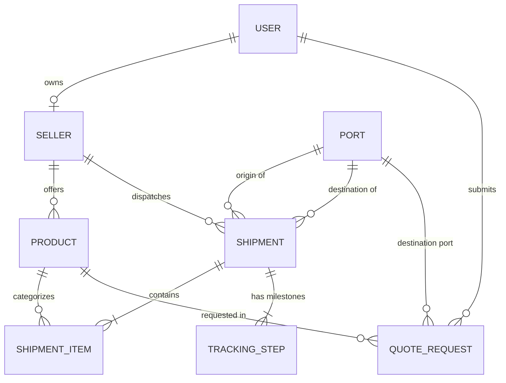

# Enterprise Architecture Blueprint: Vasista Global Import/Export Platform

> **Role**: Principal Software Architect & Senior Full-Stack Developer  
> **Repository**: `sivalocted/vasista-exports-and-imports`  
> **Core Priority**: "Strong base that is extremely easy to edit and maintain afterwards" via strict architectural rules, type safety, and modularity.

---

## 1. System Technology Stack

| Layer | Technology | Architectural Rationale |
|---|---|---|
| **Frontend Framework** | **Next.js (App Router)** + **React Server Components (RSC)** | Server-side rendering for catalog SEO, streaming data for live freight tracking, and minimal client-side JS overhead. |
| **Language & Safety** | **Strict TypeScript** (`tsconfig.json` with strict mode enabled) | End-to-end type safety between database models, Server Actions, and client components. |
| **Styling & Design System** | **Tailwind CSS** | Consistent utility-first design tokens matching industrial aesthetics (obsidian ground, amber accents). |
| **Database & ORM** | **PostgreSQL** + **Prisma ORM** | Enforces relational integrity across multi-tenant Sellers, Products, Shipments, and Global Port Terminals. |
| **API & Backend Layer** | **Next.js Server Actions** + Lightweight Type-Safe Handlers | Colocated mutations with direct database access, eliminating boilerplate REST controllers while keeping validation airtight. |

---

## 2. Comprehensive Directory Layout

```plaintext
vasista-exports-and-imports/
├── app/                                # Next.js App Router Root
│   ├── layout.tsx                      # Global root layout (Fonts, Meta, Theme Providers)
│   ├── page.tsx                        # Public landing page (Hero, Catalog, Tracker, RFQ)
│   ├── actions/                        # Next.js Server Actions (Mutations & DB operations)
│   │   ├── tracking.ts                 # Mutation for injecting & updating tracking steps
│   │   ├── rfq.ts                      # RFQ processing & notification dispatch
│   │   └── catalog.ts                  # Product filtering & search actions
│   ├── catalog/                        # Product catalog routes
│   │   ├── page.tsx                    # B2B Product Catalog view with HS Code filters
│   │   └── [slug]/page.tsx             # Deep technical specification sheet view
│   ├── tracking/                       # Public Freight & Container Tracking lookup
│   │   └── page.tsx                    # Public container tracking search
│   └── dashboard/                      # Institutional Management & Admin Portal
│       ├── layout.tsx                  # Authenticated layout with sidebar & breadcrumbs
│       ├── tracking/                   # Freight & Shipment Tracking System
│       │   ├── page.tsx                # Dashboard tracking terminal (Server Component)
│       │   ├── tracking-step-registry.ts # Pluggable step definitions registry
│       │   └── components/
│       │       └── ShipmentTrackingTimeline.tsx # Modular timeline renderer
│       ├── rfq/                        # RFQ Management Desk
│       │   └── page.tsx                # Quote review, margin calculator, supplier matching
│       └── products/                   # Catalog Management
│           └── page.tsx                # Seller inventory & specification manager
├── components/                         # Shared UI Component Library
│   ├── ui/                             # Atomic primitives (Button, Modal, Input, Badge)
│   ├── catalog/                        # Product cards, HS Code tags, MOQ badges
│   ├── tracking/                       # Route map visualizer, milestone indicators
│   └── rfq/                            # RFQ Multi-step modal engine & calculator
├── prisma/                             # Database & Relational Boundary Definitions
│   ├── schema.prisma                   # Strict Prisma schema (PostgreSQL)
│   └── seed.ts                         # Seed script for ports, HS codes, and initial commodities
├── types/                              # Central Domain TypeScript Contracts
│   └── index.ts                        # Strict interfaces (B2BProduct, FreightShipment, Port, etc.)
├── docs/                               # Production Deployment for GitHub Pages
│   ├── index.html                      # Standalone interactive application
│   ├── content.js                      # Master B2B catalog database
│   ├── script.js                       # Client-side reactivity & tracking simulation
│   ├── styles.css                      # Utility styling matching obsidian/amber aesthetic
│   └── assets/                         # Optimized photographic & brand media
├── tsconfig.json                       # Strict TypeScript configuration
└── package.json                        # Monorepo configuration
```

---

## 3. Strict Relational Database Schema (`schema.prisma`)

The Prisma schema defines relational boundaries for global maritime trade:



### Relational Entities:
1. **`Seller`**: Institutional trading house or verified producer (with GSTIN/Tax ID, verification status, and compliance score).
2. **`Port`**: UN/LOCODE indexed maritime gateways (e.g. `INVTZ` - Visakhapatnam, `INNSA` - JNPT Mumbai, `SGSIN` - Singapore, `NLRTM` - Rotterdam, `AEJEA` - Jebel Ali).
3. **`Product`**: Global B2B commodity catalog enforcing:
   - **`hsCode`**: International 6-digit Harmonized System tariff code (e.g., `2521.00`, `2601.11`).
   - **`originCountry`**: Country of mining, synthesis, or cultivation.
   - **`moq`**: Minimum Order Quantity value (e.g. `100 MT`, `25 MT / 1x20ft FCL`).
4. **`Shipment`**: Freight consignment handling container numbers (`containerNumber`), Bill of Lading (`billOfLading`), vessel voyage, origin port, and destination port.
5. **`TrackingStep`**: Ordered operational milestones with location and structured JSON metadata.
6. **`QuoteRequest` (RFQ)**: Custom form engine entity capturing commodity, HS code, target Incoterms (`CIF`, `FOB`, `CFR`, `EXW`), destination port, and buyer contact details.

---

## 4. Pluggable Tracking Step Injection Pattern

To achieve the technical priority — **"strong base that is extremely easy to edit and maintain afterwards"** — the tracking system uses the **Pluggable Step Registry Pattern** (`app/dashboard/tracking/tracking-step-registry.ts`).

### How a Developer Injects a New Tracking Step:
To add a new operational milestone (e.g., *Phytosanitary Clearance*, *Radiation Scrap Inspection*, or *Weighbridge Gross Out*), a developer only needs to register the step definition in one place:

```typescript
// No modifications required in global timeline components or shared pages!
registerTrackingStep({
  stepCode: "PHYTO_CUSTOMS_CLEARANCE",
  title: "Phytosanitary & Plant Quarantine Approval",
  description: "Official Plant Protection & Quarantine inspection certificate issued at port.",
  iconName: "ShieldAlert",
  category: "COMPLIANCE",
});
```

The timeline component dynamically matches the `stepCode`, fetches the display metadata, renders the appropriate category badge, and formats any custom metadata fields without touching global code.

---

## 5. Request for Quote (RFQ) Form Engine

The RFQ engine connects prospective institutional buyers directly to the commercial desk:
- **Automatic HS Code Linking**: Selecting a commodity automatically suggests its 6-digit HS code and standard MOQ.
- **Incoterms Compliance**: Strictly typed selection between CIF, FOB, CFR, and EXW.
- **Port Matching**: Links to gateway discharge ports or captures custom industrial delivery points.
- **Dual-Channel Dispatch**: Submits asynchronously via Server Action to PostgreSQL and formats an instant WhatsApp quotation payload for fast closing.
